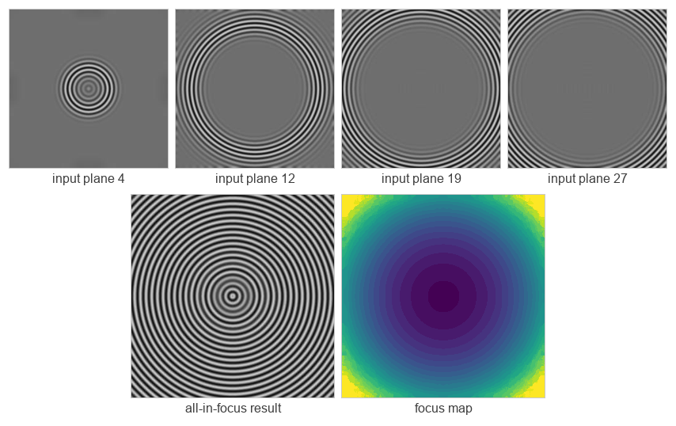

# PVT-EDOF

**An effective pyramid vision transformer-based extended depth of focus technique for optimally focused microscopic imaging**

Ramazan Özgür Doğan¹, Hülya Doğan², Alper Yılmaz³, Sena F. Sezen⁴
*The Journal of Supercomputing* **82**, 634 (2026). [doi.org/10.1007/s11227-026-08761-6](https://doi.org/10.1007/s11227-026-08761-6)

<sub>¹ Department of Artificial Intelligence Engineering, Trabzon University · ² Department of Software Engineering, Karadeniz Technical University · ³ Photogrammetric Computer Vision Laboratory, The Ohio State University · ⁴ Department of Pharmacology, Karadeniz Technical University</sub>

[](LICENSE)
[](https://www.python.org/)
[](https://pytorch.org/)

---

Reference implementation of PVT-EDOF: it fuses a focal stack into one all-in-focus image using a Pyramid Vision Transformer encoder pretrained self-supervised on natural images. A Spatial Frequency measure over the deep features scores focus per pixel, and the sharpest plane's original pixel is copied into the output. Nothing is averaged, interpolated or generated.

**The method, the evaluation and the results are in the paper.** This repository is the model and the two commands that drive it: pretraining and fusion.



<sub>The synthetic stack bundled in `data/synthetic_demo/`, fused with the trained model. Four of its thirty input planes, then the all-in-focus result and the focus map, which is also a relative depth map. Produced by this repository with `python -m pvtedof --stack data/synthetic_demo --out results/demo`; it corresponds to Figure 6 of the paper. Every pixel of the result is copied unchanged from the plane the focus map selects, which is verifiable from the `.npy` the same command writes.</sub>

- [PVT-EDOF](#pvt-edof)
  - [Installation](#installation)
  - [Model weights](#model-weights)
  - [Training the encoder](#training-the-encoder)
    - [1. Get MS-COCO 2017](#1-get-ms-coco-2017)
    - [2. Smoke-test, then train](#2-smoke-test-then-train)
    - [3. Point the code at the result](#3-point-the-code-at-the-result)
  - [Running it](#running-it)
  - [What is in `pvtedof/`](#what-is-in-pvtedof)
  - [Data](#data)
  - [Citation](#citation)
  - [License and acknowledgements](#license-and-acknowledgements)

## Installation

Python 3.9 or newer. Install PyTorch first, since the build has to match your CUDA version and [pytorch.org](https://pytorch.org/get-started/locally/) gives you the right command line for it.

```bash
git clone https://github.com/doganr/pvt-edof.git
cd pvt-edof

conda create -n pvtedof python=3.11
conda activate pvtedof

pip install torch torchvision      # or the CUDA-specific line from pytorch.org
pip install -r requirements.txt
pip install -e .                   # optional, lets you `import pvtedof` from anywhere
```

Dependencies are `torch`, `torchvision`, `numpy`, `Pillow`, `tqdm`, `einops` and `timm`. A GPU is strongly recommended for training and optional for fusion, which falls back to CPU and to Apple MPS.

## Model weights

A checkpoint from one example experiment is attached to the [latest release](https://github.com/doganr/pvt-edof/releases/latest) as `pvtedof_coco_t96.pt`, 5.4 MB. Nothing is tracked in git; put the file where the commands look for it:

```bash
mkdir -p checkpoints
curl -L -o checkpoints/pvtedof.pt \
  https://github.com/doganr/pvt-edof/releases/latest/download/pvtedof_coco_t96.pt
```

It is `t = 96`, pretrained on MS-COCO 2017 with λ = 100, and it produced the figure above.

## Training the encoder

You can skip this section if you took the checkpoint above. The encoder is pretrained self-supervised: it reconstructs its own grayscale input under `L1 + λ · (1 - MS-SSIM)`, so there are no labels, no all-in-focus ground truth and no annotation files anywhere in the procedure.

### 1. Get MS-COCO 2017

One archive, `train2017.zip`: 118,287 images, about 18 GB. Only the images are needed, never the annotation files, and there is no validation split to fetch. The objective reconstructs its own input, so nothing is held out and nothing is measured against labels.

```bash
# from https://cocodataset.org/#download
wget http://images.cocodataset.org/zips/train2017.zip
unzip train2017.zip -d /path/to/coco
```

```powershell
# Windows PowerShell
Invoke-WebRequest http://images.cocodataset.org/zips/train2017.zip -OutFile train2017.zip
Expand-Archive train2017.zip -DestinationPath C:\data\coco
```

Put it **outside this repository**; `data/` here is for focal stacks. The loader expects a flat directory of image files and does not recurse, so point `--dataset` at `train2017/` itself, not at its parent:

```
/path/to/coco/train2017/
├── 000000000009.jpg
├── 000000000025.jpg
└── ...                     118,287 files, no subdirectories
```

Anything that is not an image is ignored, so a stray checksum file is harmless. Worth confirming before starting a run that takes days:

```bash
ls /path/to/coco/train2017 | wc -l      # expect 118287
```

### 2. Smoke-test, then train

Run one epoch over a slice of the same directory first. It takes minutes and fails fast if the path or the environment is wrong; the weights it produces are a plumbing test, nothing more.

```bash
python -m pvtedof.train --dataset /path/to/coco/train2017 --limit 500 --epochs 1
```

Then the paper's settings:

```bash
python -m pvtedof.train --dataset /path/to/coco/train2017 \
    --epochs 20 --batch-size 6 --embed-dim 96 --learning-rate 1e-5 \
    --ssim-index 2 --save-every 1 --save-model-dir checkpoints
```

`--ssim-index` selects λ from `[1, 10, 100, 1000, 10000]`; index 2, λ = 100, is what the published experiments were run with. The remaining flags play no part in the paper: `--ape` adds a learnable absolute position embedding, `--limit` is the smoke-test slice above, and `--num-workers` sets the DataLoader worker count (4). `python -m pvtedof.train --help` lists them all. Everything the flags do not cover is fixed by `ModelConfig`: four stages of three blocks, 4/8/16 attention heads, W-MSA window sizes 2/4/8.

Training uses `cuda:0` when a GPU is visible and CPU otherwise; a 20-epoch run over 118k images is not practical on CPU. If you hit out-of-memory, lower `--batch-size`. That changes the optimisation trajectory, so the result is your own variant rather than a reproduction.

The published model was trained on an AMD Ryzen 9 7900X with 32 GB of RAM and an NVIDIA RTX A6000 (48 GB) under Windows.

### 3. Point the code at the result

`--save-every 1` writes one checkpoint per epoch plus a final one into `--save-model-dir` (default `./checkpoints/`, created on demand and gitignored):

```
checkpoints/pvtedof_t96_1e2_20260808_143000_epoch00.pt
...
checkpoints/pvtedof_t96_1e2_20260808_143000_final_epoch20.pt
```

The name records `t`, the λ tag, a run timestamp and the epoch, so a checkpoint always states what it was trained with. Each is about 5.4 MB; `--save-every 0` keeps only the final one. Per-batch loss curves land in `--save-loss-dir` (default `./results/loss/`) as `loss_{pixel,ssim,total}_*.npy`.

`python -m pvtedof` and `load_model` both fall back to `checkpoints/pvtedof.pt`, so copy the one you settled on there once:

```bash
cp checkpoints/pvtedof_t96_1e2_20260808_143000_final_epoch20.pt \
   checkpoints/pvtedof.pt
```

That path is only a convention; `--checkpoint` and `load_model` take any file. The feature dimension `t` and whether `--ape` was used are both read off the checkpoint, so the name carries no meaning either way. The one thing a checkpoint does not record is the resolution it was trained at.

## Running it

A 30-plane synthetic focal stack ships with the repository, so once a checkpoint is in place this runs as is:

```bash
python -m pvtedof --stack data/synthetic_demo --out results/demo
```

It writes three files, prefixed with the stack's folder name (`synthetic_demo` here, or whatever `--name` says): `_fused.png`, the all-in-focus image at input resolution; `_focusmap.png`, the selected plane index per pixel colour-coded with viridis; and `_focusmap.npy`, the raw indices. For your own data, point `--stack` at a directory holding the planes of one stack:

```bash
python -m pvtedof --stack /path/to/my_stack --out results/my_stack --device cuda
```

| Option | Default | Meaning |
|---|---|---|
| `--stack` | *(required)* | the directory of focal planes |
| `--checkpoint` | `checkpoints/pvtedof.pt` | the weights to fuse with |
| `--out` | `results` | output directory, created if missing |
| `--name` | the stack folder's name | prefix of the three output files |
| `--stride` | `64` | subimage step; below 128 so subimages overlap, which is what keeps the tile grid out of the output |
| `--pad` | `64` | reflection padding before tiling, which removes the outer-border seam |
| `--subimage-batch` | `64` | subimages per encoder call, the throughput knob; `0` selects the unbatched reference path |
| `--input-scale {unit,raw}` | `unit` | `unit` divides by 255 to match training, `raw` passes 0-255 through |
| `--device` | `auto` | `auto`, `cuda`, `mps` or `cpu` |
| `--cmap` | `viridis` | colour table for the focus map PNG, `viridis` or `gray`; the `.npy` indices are unaffected |

`pvtedof.throughput_sweep(model, gray)` measures seconds per stack and peak GPU memory across a range of `--subimage-batch` values, if you want to pick one for your hardware rather than take the default.

As a library:

```python
from pvtedof import fuse, load_model, load_stack

model = load_model("checkpoints/pvtedof.pt", device="cuda")
rgb, gray = load_stack("data/synthetic_demo")    # rgb: (n,H,W,3) uint8, gray: (n,H,W) float32

all_in_focus, focus_map = fuse(model, rgb, gray, device="cuda")
```

That single call is the whole fusion stage. Tiling and seam handling are inside it: subimages overlap at `stride=64`, each output pixel is taken from the tile in which it lies most centrally, and the outer border is reflection-padded. None of that is a filter applied afterwards, so the output stays a mosaic of original acquired pixels. `fuse` warns if you pass `stride >= 128` or `pad == 0`, which remove the overlap this depends on.

`focus_map[y, x]` is the index of the focal plane chosen at that pixel, so it doubles as a relative depth map. `pvtedof.colorize(focus_map)` returns it as an `(H, W, 3)` uint8 viridis image if you are assembling your own figures. `pvtedof.select_pixels(other_stack, focus_map)` applies the same map to any array whose first axis is the plane axis, and `pvtedof.focus_measures.MEASURES` maps a name to `f(features, device) -> decision_map` if you want to score focus with something other than Spatial Frequency.

## What is in `pvtedof/`

| Module | Contents |
|---|---|
| `model.py` | the PVT-EDOF encoder-decoder and `ModelConfig` |
| `blocks.py` | patch embedding, W-MSA with relative position bias, the PVT block |
| `focus_measures.py` | Spatial Frequency (Eq. 7-9) and the ablation measures |
| `fusion.py` | tiling, decision maps, pixel selection (Module 2 of the paper) |
| `data.py` | focal-stack loading and input scaling |
| `checkpoints.py` | checkpoint loading and device selection |
| `colormap.py` | the viridis table, so focus maps colour without matplotlib |
| `train.py` | self-supervised MS-COCO pretraining |
| `__main__.py` | the fusion command line |
| `third_party/ms_ssim.py` | vendored MS-SSIM, used by the training loss |

## Data

One directory per focal stack, holding only the planes of that stack, named so they sort into acquisition order. Planes are read with `PIL` in sorted filename order; `.png`, `.jpg`, `.jpeg`, `.tif`, `.tiff` and `.bmp` are recognised. Every plane must have the same resolution; `load_stack` raises rather than silently truncating. Keep outputs out of the stack directory; a stray fused image would be read back in as an extra focal plane.

Planes smaller than the 128 px subimage are not rejected up front. Tiling runs on the *padded* image, so at the default `--pad 64` even a 30 px plane goes through without an error; the `ValueError` about the subimage size comes from `fusion.tile_starts` only when padding still leaves less than 128 px, which in practice means you lowered `--pad`. It will still run, but a plane much smaller than one subimage is mostly reflected padding and the result means little.

**Synthetic series.** A 30-plane, 256×256 concentric-ring stack ships in `data/synthetic_demo/`, so the repository is runnable once you have a checkpoint. It is the stack of Figure 6 and the concentric-ring row of Table 3. The full sixteen-series set can be regenerated with the publicly available defocus simulation model of Pertuz et al. using the configurations in Table 2 of the paper.

**Real microscopic series.** The six series (heart, kidney, liver, lung, blood and HaCaT) are **not publicly released at this stage**: both the dataset and the surrounding algorithmic work are still being expanded. They are available from the corresponding author on reasonable request under a confidentiality agreement, and will be released once the collection is final. This mirrors the data-availability and ethics statements of the paper; sample acquisition was approved under 2022/57 by the Karadeniz Technical University Animal Experiments Local Ethics Committee.

`.gitignore` tracks only `data/synthetic_demo/*.jpg`; anything else you drop under `data/` stays out of git, deliberately, so that embargoed series cannot be committed by accident.

## Citation

```bibtex
@article{Dogan2026,
  title     = {An effective pyramid vision transformer-based extended depth of
               focus technique for optimally focused microscopic imaging},
  author    = {Dogan, Ramazan Ozgur and Dogan, Hulya and
               Yilmaz, Alper and Sezen, Sena F.},
  journal   = {The Journal of Supercomputing},
  publisher = {Springer},
  year      = {2026},
  volume    = {82},
  number    = {12},
  pages     = {634},
  doi       = {10.1007/s11227-026-08761-6}
}
```

`pages` carries the article number, which is how Springer numbers articles in this journal. [`CITATION.cff`](CITATION.cff) has the same record.

## License and acknowledgements

Released under the [MIT License](LICENSE).

This work was supported by the Karadeniz Technical University Office of Scientific Research Projects, Türkiye (Project number: TSA-2019-8561, FBB-2023-10975). Additionally, support was provided through funding by the Turkish Scientific and Technological Research Council (TUBITAK) 2219 International Postdoctoral Research Scholarship Program (Project numbers 1059B192300257 and 1059B192300233) and TUBITAK 3501 Research Project 125E093.

Questions, and requests for the microscopic dataset: **dogan@trabzon.edu.tr**
